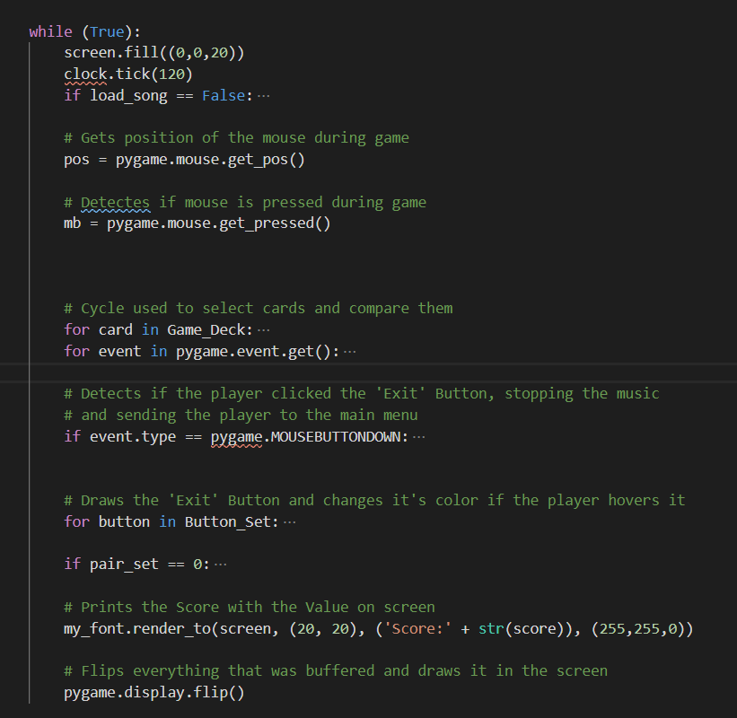

# Objetivo do Projeto
Com este projeto o meu objetivo era criar um jogo de memória através de um baralho de carta, que fosse um pouco diferente da proposta do professor, tendo adicionado como *feature* o movimento vertical das cartas com uma velocidade relativa aos batimentos por minuto (BPM) de cada musíca referente a cada nível. Para isto transformei o BPM de cada musica em milisigundos e atribui esse valor para definir a velocidade a que as cartas se movem.

# Abordagem ao Problema
Inicialmente comecei por tentar programar um menu principal,utilizando apenas um ficheiro, com todos os botões pretendidos, ou seja, os botões para cada nível e um botão de saída que encerra o jogo. Para isto criei uma classe *Button* que recebe todos os parâmetros necessários para a funcionalidade pretendida.

Após ter criado todos os botões comecei por programar o primeiro nível "4x3", utilizando um ficheiro separado do ficheiro do *main menu* que é chamado ao clicar no botão "4x3". Para isto criei a classe *Card* com todos os paramatetros que são necessários para aquilo que é o jogo em sim.

Depois de feitas as  classes, criei uma lista "manual" de todas as cartas de jogo que incluiam as suas posições, tamanhos, cor e um valor utilizado para a comparação entre cartas.

Com o *Game Board* criado inicializei o ciclo que mantem o jogo a correr, desenhando todas as cartas no ecra, voltando cada carta com uma forma e uma cor, comparando-as com a escolha seguinte do jogador e atribuindo um valor de pontuação a mais caso o jogador acerte e removendo as cartas combinadas ou removendo pontos e voltando as cartas de novo para baixo.
 
Nesta fase inicial ainda não seria implementada a musica e o movimento vertical das cartas.

Com a evolução do projeto e com a sugestão/ajuda do professor transformei os vários ficheiros de cada nível num só ficheiro que é geral a todos os níveis recebendo 2 variáveis das quais o código está dependente, tendo terminado o projeto com apenas 3 ficheiros, o principal do qual e inicializado o programa, o do *main menu* e o ficheiro de nível.
# Estrutura do Código
- shuffle.py (Ficheiro Principal)
  - Recebe todas as funções e inicia a função de nivel consoante as variáveis dadas, que representao o numero de cartas na vertical, na horizontal e o espaço de tempo que a carta tem para se mover, em milisegundos.
  - Dá load há musica do *main menu* e inicia-a logo a seguir.
  
  
    

- Level_01.py (Ficheiro com o código do baralho e constitui 90% do jogo.)
  - Classe "Cards"
    - Recebe todos os parametros necessários para o jogo existir, sendo estes a posição *(tuplo(x,y))*, cor *(tuplo(R,G,B))*, tamanho *width*, tamanho *height*, match *(tuplo(forma, cor))*, variável que é usada para comparar as cartas de maneira a eliminá-las ou voltá-las para baixo de novo e uma variável que verifica se a carta está voltada para cima ou não.

      
    
    - Recebe uma função *draw()* que desenha a carta no ecrã os parametros passados na classe.
    
      

    - Recebe uma função *isOver()* que verifica se o rato do jogador está por cima da carta.
 
      

    - Refere um função *shape_draw()* que verifica se a carta está selecionada e, através da variável *match[0]*, o valor da forma, define     que forma vai ser desenhada na carta após esta ser selecionda. Se *match[0]* for 0 desenha um círculo, se 1 desenha um quadrado, se 2    desenha um triângulo. Todo o código para cada forma é definido pelos valores da carta em si.
    
      

  - Classe "Buttons"
    - Recebe a classe "Buttons" definida no *main_menu.py*
    - É utilizada apenas para colocar o botão "Exit" no ecrã de forma a voltar ao *main_menu*

  -  Função *check_pair()* utilizada para comparar as duas cartas selecionadas
 
     

  -  Função *levels(Cx,Cy,time)* que define o jogo e recebe as variaves que definem o tamanho do *deck* de jogo e a variavél *time* que define a velociade a que as cartas mexem.

  - No ínicio da função, defino todos os valores típocos do pygame, como o tamanha da janela (res), a definir a area de jogo consoante a janela (screen) e a fonte (my font) utilizada nos botões e score.

    

  - De seguida começo por definir as possíveis coordenadas de cada carta, utilizando 3 listas que são iniciadas vazias, *Card_Position*, *pos_x*, *pos_y*. 1º Defino o tamanho total, em *y*, do tabuleiro de jogo (*Total_H*) e o espaço entre cada carda (*padding*), depois calculo o tamnho de cada carta para esse nível, utilizando as variáveis *Board*, passadas pela função, a *Total_H* e o padding. Com isto consigo calcular os restantes valores em torno de *x*. Finalmente junto a lista de posições em *x* e as posições em *y* na lista *Card_Position*.

    

  - No próximo passo crio novamente 3 listas, a lista de cores usadas durante o jogo (*RGB*), a lista de formas a desenhar (*Shapes(1,2,3)*), e uma lista vazia onde vou juntar a lista de *RGB* e *Shapes* e vou dar *shuffle* de maneira a randomizar cada jogo.
 
    
  
  - Finalmente crio o *Deck de Jogo* utilizando a lista vazia *Card_Sequence* onde junto metade do total de cartas de forma a criar os pares totais e dou *shuffle* no final antes de efetivamente criar a lista final com o total de cartas para o nível ativo, utilizando as variáveis criadas anteriormente, e termino, desenhando-as antes de iniciar o ciclo do jogo.
 
    
  
  - Antes de inicar o ciclo do jogo defino também todas as variáveis utilizadas durante o ciclo.
   
    

  - Inico o ciclo onde o jogo acontece, onde utilizo todas as funções e variáveis criadas de forma a produzir o jogo completo.

    

- *main.menu.py*
  - Classe "Buttons"
    - Semelhante á classe "Cards" tem duas funções e é utilizada para definir todos os botões do menu principal.
  
      

  - Função *Main_Menu(bool)* onde se seleciona as variáveis que vão ser passadas à função *levels* e se dá load e play à música desse nível específico.
  
      

# Conclusão
Com este trabalho foi me possível compreeder muito melhor toda a matéria de python, pois foi possível aplicá-la a algo "real" e permitiu-me finalmente perceber a eficácia de "for" e ciclos, algo que sempre me causou dúvidas durante o semestre, tendo sido aqui onde tive mais dúvidas ao implementar um nível geral utilizando estes ciclos de forma a facilitar o aumento de cartas consoante o nível.
Em suma gostei muito de realizar este projecto e apesar de não ter consigo fazer a minha idea na toatalidade e não ter conseguido implementar o *delay* depois de voltar duas cartas estou muito contente com o resultado final.
**AVISO:** Considere baixar o seu volume geral antes de iniciar o *.exe* pois não tive tempo de implementar um botão de *mute* ou um *slider* de volume.

# Créditos e Referências
Todo o código foi realizado consultando toda a matéria leccionada pelo professor Diogo Andrade, dísponivel no moodle. Com especial ajuda dos meus colegas Daniel Fernandes, Marco Domingos e Pedro Miguel Marques, que me ajudaram a resolver certos problemas que se foram levantando ao longo do projecto.
Classe de butões criada através da consulta deste vídeo: [https://www.youtube.com/watch?v=4_9twnEduFA]

Musicas(Youtube):
- "Main_Menu" - Duel of Fates 8 bits by GhostVoltage
- "4x3" - Shooting Stars 8 bits by  8 Bit Universe
- "4x4" - Star Wars Cantina Theme 8 bits by  8 Bit Universe
- "5x4" - Darude Sandstorm 8 bits by  8 Bit Universe
- "6x5" - Crazy Frog 8 bits by  8 Bit Universe
- "6x6" - We are number one 8 bits by  8 Bit Universe
- "Congratulations" - Pewdipie's Congratulations 8 bits by 8 Bit Universe

Git Link:
